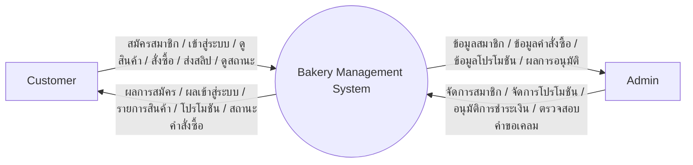
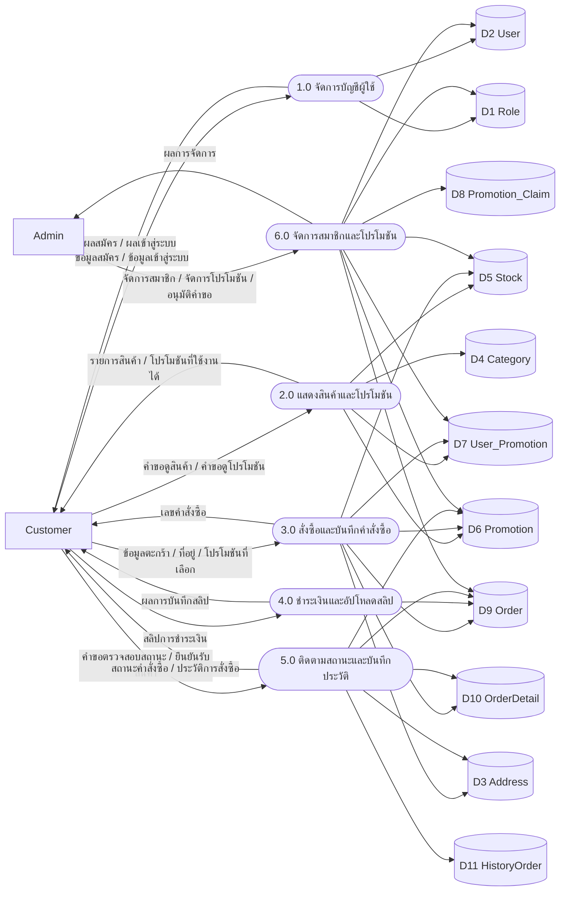

# Data Flow Diagram

## วัตถุประสงค์

เอกสารนี้อธิบายแผนภาพการไหลของข้อมูล (Data Flow Diagram: DFD) ของระบบร้านเบเกอรี่ โดยสรุปการรับข้อมูล ประมวลผล จัดเก็บ และส่งออกข้อมูลระหว่างผู้ใช้งาน ระบบ และฐานข้อมูล

## ขอบเขตของระบบ

ระบบที่นำมาอธิบายครอบคลุมงานหลักดังนี้

- สมัครสมาชิกและเข้าสู่ระบบ
- ดูสินค้าและโปรโมชัน
- สั่งซื้อสินค้า
- อัปโหลดสลิปชำระเงิน
- ติดตามสถานะการจัดส่ง
- จัดการสมาชิกและโปรโมชันโดยผู้ดูแลระบบ

## สัญลักษณ์ที่ใช้

- External Entity: ผู้ใช้งานภายนอกระบบ เช่น ลูกค้า หรือแอดมิน
- Process: กระบวนการทำงานของระบบ
- Data Store: แหล่งเก็บข้อมูล เช่น ตารางในฐานข้อมูล
- Data Flow: การไหลของข้อมูลระหว่างองค์ประกอบ

## 1. Context Diagram

ภาพรวมระดับสูงสุดของระบบ

## 2. DFD Level 1

แยกระบบออกเป็นกระบวนการหลัก

## 3. DFD Level 1 คำอธิบายแต่ละกระบวนการ

### 3.1 Process 1.0 จัดการบัญชีผู้ใช้

อินพุต:

- Username, email, phone, password
- ข้อมูล login

การประมวลผล:

- ตรวจสอบข้อมูลสมัครสมาชิก
- บันทึกผู้ใช้ใหม่
- ตรวจสอบ username หรือ email กับ password ตอน login
- สร้าง session ผู้ใช้

แหล่งเก็บข้อมูลที่เกี่ยวข้อง:

- `user`
- `role`

เอาต์พุต:

- ผลสมัครสมาชิก
- ผลเข้าสู่ระบบ
- สิทธิ์ผู้ใช้งาน

### 3.2 Process 2.0 แสดงสินค้าและโปรโมชัน

อินพุต:

- คำขอเปิดหน้าเมนูสินค้า
- คำขอเปิดหน้าโปรโมชัน

การประมวลผล:

- ดึงรายการสินค้าและหมวดหมู่
- ดึงโปรโมชันที่เปิดใช้งานและยังไม่หมดอายุ
- จัดเตรียมข้อมูลของแถมและโปรโมชันที่ลูกค้าใช้ได้

แหล่งเก็บข้อมูลที่เกี่ยวข้อง:

- `stock`
- `category`
- `promotion`
- `user_promotion`

เอาต์พุต:

- รายการสินค้า
- รายการโปรโมชัน
- ข้อมูลสินค้าของแถม

### 3.3 Process 3.0 สั่งซื้อและบันทึกคำสั่งซื้อ

อินพุต:

- ข้อมูลรายการสินค้าในตะกร้า
- ที่อยู่จัดส่ง
- โปรโมชันที่เลือกใช้

การประมวลผล:

- ตรวจสอบความถูกต้องของข้อมูลสั่งซื้อ
- สร้างคำสั่งซื้อใน `order`
- สร้างรายการสินค้าใน `orderdetail`
- ตัดสิทธิ์โปรโมชันที่ใช้แล้วใน `user_promotion`
- เพิ่มรายการของแถมเมื่อเข้าเงื่อนไขโปรโมชัน

แหล่งเก็บข้อมูลที่เกี่ยวข้อง:

- `order`
- `orderdetail`
- `promotion`
- `promotion_reward_item`
- `user_promotion`
- `address`
- `stock`

เอาต์พุต:

- เลขที่คำสั่งซื้อ
- ผลการสร้างคำสั่งซื้อ

### 3.4 Process 4.0 ชำระเงินและอัปโหลดสลิป

อินพุต:

- ไฟล์สลิปชำระเงิน
- รหัสคำสั่งซื้อ

การประมวลผล:

- บันทึกไฟล์สลิปลงโฟลเดอร์ `wwwroot/uploads/slips`
- อัปเดต `SlipImagePath`
- เปลี่ยน `PaymentStatus` เป็น `PendingVerify`

แหล่งเก็บข้อมูลที่เกี่ยวข้อง:

- `order`

เอาต์พุต:

- ผลการอัปโหลดสลิป
- สถานะรอตรวจสอบ

### 3.5 Process 5.0 ติดตามสถานะและบันทึกประวัติ

อินพุต:

- คำขอตรวจสอบสถานะคำสั่งซื้อ
- คำสั่งยืนยันรับสินค้า

การประมวลผล:

- ดึงคำสั่งซื้อปัจจุบันและประวัติย้อนหลัง
- แสดงสถานะการชำระเงินและสถานะจัดส่ง
- เมื่อยืนยันรับสินค้า จะย้ายข้อมูลสำคัญไปเก็บใน `historyorder`
- อัปเดตสถานะคำสั่งซื้อเป็น `Completed`

แหล่งเก็บข้อมูลที่เกี่ยวข้อง:

- `order`
- `orderdetail`
- `historyorder`
- `address`
- `promotion`

เอาต์พุต:

- หน้าติดตามสถานะ
- ประวัติคำสั่งซื้อ

### 3.6 Process 6.0 จัดการสมาชิกและโปรโมชัน

อินพุต:

- ข้อมูลเพิ่ม/แก้ไข/ลบสมาชิก
- ข้อมูลเพิ่ม/แก้ไขโปรโมชัน
- คำสั่งแจกโปรโมชัน
- คำสั่งอนุมัติหรือปฏิเสธคำขอเคลม

การประมวลผล:

- จัดการข้อมูลผู้ใช้และบทบาท
- จัดการข้อมูลโปรโมชันและของแถม
- แจกโปรโมชันให้รายบุคคลหรือทุกคน
- ตรวจคำขอใน `promotion_claim`
- เมื่ออนุมัติ จะบันทึกสิทธิ์ลง `user_promotion`

แหล่งเก็บข้อมูลที่เกี่ยวข้อง:

- `user`
- `role`
- `promotion`
- `promotion_reward_item`
- `promotion_claim`
- `user_promotion`
- `stock`
- `order`

เอาต์พุต:

- ผลการจัดการสมาชิก
- ผลการจัดการโปรโมชัน
- ผลการอนุมัติคำขอ

## 4. Data Store ที่เกี่ยวข้อง

| รหัส | Data Store | รายละเอียด |
|---|---|---|
| D1 | `role` | เก็บประเภทสิทธิ์ของผู้ใช้ |
| D2 | `user` | เก็บข้อมูลผู้ใช้งาน |
| D3 | `address` | เก็บที่อยู่จัดส่ง |
| D4 | `category` | เก็บหมวดหมู่สินค้า |
| D5 | `stock` | เก็บข้อมูลสินค้า |
| D6 | `promotion` | เก็บข้อมูลโปรโมชัน |
| D7 | `user_promotion` | เก็บสิทธิ์โปรโมชันของผู้ใช้ |
| D8 | `promotion_claim` | เก็บคำขอเคลมโปรโมชัน |
| D9 | `order` | เก็บคำสั่งซื้อหลัก |
| D10 | `orderdetail` | เก็บรายการสินค้าในคำสั่งซื้อ |
| D11 | `historyorder` | เก็บประวัติคำสั่งซื้อที่เสร็จสมบูรณ์ |

## 5. วิธีเปิดดู Data Flow Diagram

### วิธีที่ 1: เปิดดูจาก Markdown ที่รองรับ Mermaid

วิธีที่ง่ายที่สุดคือเปิดไฟล์นี้ในโปรแกรมที่รองรับ Mermaid เช่น

- VS Code และติดตั้ง extension ที่รองรับ Mermaid Preview
- GitHub หรือ GitLab ที่รองรับการเรนเดอร์ Mermaid
- Markdown viewer อื่น ๆ ที่รองรับ Mermaid

ถ้าใช้ VS Code แนะนำขั้นตอนนี้

1. เปิดไฟล์ `DataFlowdiagram.md`
2. ติดตั้ง extension เช่น `Markdown Preview Mermaid Support`
3. กด `Ctrl+Shift+V` เพื่อเปิด preview

### วิธีที่ 2: เปิดด้วย draw.io (แนะนำ)

ถ้าอยากได้เป็นแผนภาพใน `draw.io` หรือ `diagrams.net` แบบแก้ไขต่อได้ แนะนำใช้วิธีนี้

1. เปิดเว็บไซต์ `https://app.diagrams.net/`
2. สร้างไฟล์ว่างใหม่
3. ไปที่เมนู `Arrange`
4. เลือก `Insert`
5. เลือก `Advanced`
6. เลือก `Mermaid`
7. คัดลอก code Mermaid จากหัวข้อ `Context Diagram` หรือ `DFD Level 1` ในไฟล์นี้ไปวาง
8. กด `Insert`

ข้อดีของวิธีนี้:

- ไม่ต้องวาดใหม่
- สามารถลากจัดตำแหน่ง ปรับสี ปรับรูปทรง ได้ต่อใน draw.io
- เหมาะกับทำรายงานหรือส่งอาจารย์ในรูปภาพสวย ๆ

## 6. Mermaid Code สำหรับใช้กับ draw.io โดยตรง

### 6.1 Context Diagram

### 6.2 DFD Level 1

## 7. คำแนะนำเพิ่มเติม

- ถ้าจะส่งรายงาน แนะนำแปลง Mermaid เป็นภาพจาก draw.io แล้วแทรกลง Word หรือ PDF
- ถ้าอาจารย์ต้องการแบบเป็นทางการมากขึ้น สามารถแยกเพิ่มเป็น DFD Level 2 ได้ เช่น แยกเฉพาะโมดูลสั่งซื้อ หรือโมดูลโปรโมชัน
- ถ้าต้องการงานที่ดูเรียบร้อยมากขึ้นใน draw.io ให้ใช้สีแยกประเภทดังนี้
- Process: สีฟ้าอ่อน
- External Entity: สีเขียวอ่อน
- Data Store: สีส้มอ่อน

