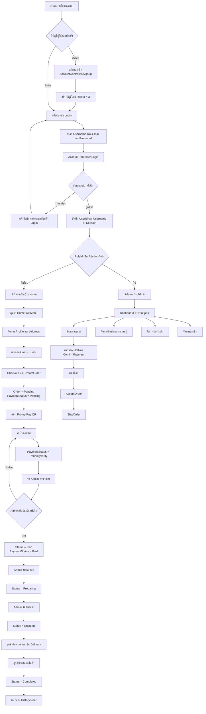
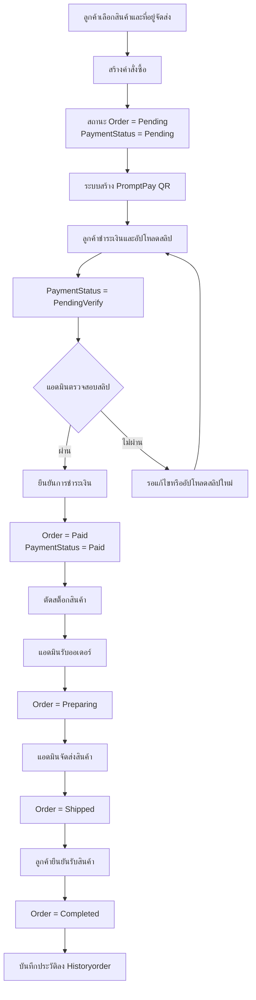

# Project-Bagery

ระบบจัดการร้านเบเกอรี่แบบเว็บแอปพลิเคชัน พัฒนาด้วย ASP.NET Core MVC สำหรับใช้งานทั้งฝั่งลูกค้าและผู้ดูแลระบบ ครอบคลุมการสมัครสมาชิก, เข้าสู่ระบบ, เลือกสินค้า, สร้างคำสั่งซื้อ, ชำระเงินด้วย PromptPay QR, อัปโหลดสลิป, ติดตามสถานะการจัดส่ง และจัดการหลังบ้าน

## ภาพรวมระบบ

| หัวข้อ | รายละเอียด |
|---|---|
| Framework | ASP.NET Core MVC (.NET 10) |
| ORM | Entity Framework Core |
| Database | MySQL |
| Frontend | Razor Views, Bootstrap, JavaScript, jQuery |
| Payment | PromptPay QR + อัปโหลดสลิป |
| Authentication | Session-based |
| Admin Access | ตรวจสอบสิทธิ์จาก `RoleId = 1` |

## ฟีเจอร์หลัก

### ฝั่งผู้ใช้ทั่วไป
- สมัครสมาชิกและเข้าสู่ระบบด้วย Username หรือ Email
- ดูเมนูสินค้าและหมวดหมู่
- จัดการข้อมูลโปรไฟล์และที่อยู่จัดส่ง
- สร้างคำสั่งซื้อและเลือกใช้โปรโมชั่น
- ชำระเงินผ่าน PromptPay QR Code
- อัปโหลดสลิปเพื่อรอแอดมินตรวจสอบ
- ติดตามสถานะออเดอร์และยืนยันรับสินค้า
- ดูประวัติคำสั่งซื้อที่เสร็จสมบูรณ์

### ฝั่งผู้ดูแลระบบ
- ดูภาพรวมธุรกิจผ่าน Dashboard
- ตรวจสอบออเดอร์และสลิปการชำระเงิน
- ยืนยันการชำระเงินและตัดสต็อกสินค้า
- เปลี่ยนสถานะออเดอร์เป็น `Preparing` และ `Shipped`
- จัดการสินค้าและหมวดหมู่
- จัดการโปรโมชั่นและแจกคูปองให้ผู้ใช้
- จัดการสมาชิกและบทบาทผู้ใช้

## ภาพรวมระบบแยกตามสิทธิ์

### ฝั่งผู้ใช้ทั่วไป (User / Customer)
- `Signup` ใช้สมัครสมาชิกใหม่และบันทึกข้อมูลผู้ใช้ลงระบบ
- `Login` ใช้ตรวจสอบตัวตนและแยกสิทธิ์การเข้าใช้งานตามบทบาท
- `Home / Menu / Promotion` ใช้แสดงสินค้า โปรโมชัน และข้อมูลหน้าร้าน
- `Profile / SaveAddress / DeleteAddress / GetUserAddresses` ใช้จัดการข้อมูลส่วนตัวและที่อยู่จัดส่ง
- `Checkout / CreateOrder / Payment / UploadSlip / Delivery / CompleteOrder` ใช้สั่งซื้อ ชำระเงิน แนบสลิป และติดตามสถานะคำสั่งซื้อ
- `GetUserPromos / SubmitPromotionClaim / GetMyNotifications` ใช้รับสิทธิ์โปรโมชันและติดตามการแจ้งเตือนของผู้ใช้

### ฝั่งพนักงาน (Staff)
- `Order / GetOrderDetails` ใช้ดูรายการออเดอร์และรายละเอียดการสั่งซื้อ
- `ConfirmPayment` ใช้ตรวจสอบการชำระเงินและอัปเดตสถานะคำสั่งซื้อ
- `AcceptOrder / ShipOrder` ใช้เปลี่ยนสถานะออเดอร์เข้าสู่ขั้นตอนเตรียมสินค้าและจัดส่ง
- `Stock / UpdateStockSettings` ใช้ดูและปรับจำนวนสต็อกหรือสถานะพร้อมขายของสินค้า
- `EventPromotion / ApproveClaim / RejectClaim` ใช้ตรวจสอบคำขอโปรโมชันจากลูกค้าและอนุมัติหรือปฏิเสธ

### ฝั่งผู้ดูแลระบบ (Admin)
- `Dashbordadmin` ใช้ดูภาพรวมของระบบ เช่น ยอดขาย คำสั่งซื้อ สินค้าใกล้หมด และข้อมูลสรุปสำคัญของร้าน
- `Member / SaveMember / DeleteMember` ใช้จัดการสมาชิกและกำหนดบทบาทของผู้ใช้
- `Stock / UpdateStockSettings / SaveCategory / SaveStock` ใช้จัดการสินค้า หมวดหมู่ และการปรับสต็อก โดยส่วนปรับสต็อกบางส่วนเป็นงานที่ทำร่วมกับ staff
- `PromotionAdmin / SavePromotion / GiftPromotion / GiftPromotionToAll` ใช้สร้าง แก้ไข บันทึก และมอบโปรโมชันให้ผู้ใช้

## Flowchart การทำงานของระบบ

```text
สมัครสมาชิก / เข้าสู่ระบบ
    ->
ตรวจสอบสิทธิ์และบทบาท
    ->
แยกเส้นทางการใช้งาน
    -> ผู้ใช้ทั่วไป
    -> ผู้ดูแลระบบ
```

### Flowchart ภาพรวมทั้งระบบ



### คำอธิบายภาพรวมของระบบ

1. ผู้ใช้เริ่มจากการสมัครสมาชิกหรือเข้าสู่ระบบผ่าน `AccountController`
2. หลัง Login สำเร็จ ระบบจะเก็บ `UserId` และ `Username` ไว้ใน Session เพื่อใช้ตรวจสอบสิทธิ์ในหน้าต่าง ๆ
3. ถ้า `RoleId = 1` ระบบจะพาไปยังฝั่งผู้ดูแลระบบ ซึ่งสามารถดู Dashboard, จัดการออเดอร์, สินค้า, โปรโมชั่น และสมาชิกได้
4. ถ้าเป็นผู้ใช้ทั่วไป ระบบจะพาไปยังหน้าใช้งานหลัก เช่น Home, Menu, Profile และ Delivery
5. ฝั่งลูกค้าจะเริ่มจากเลือกสินค้า, เลือกที่อยู่จัดส่ง, ใช้โปรโมชั่น, สร้างออเดอร์, ชำระเงินด้วย PromptPay และอัปโหลดสลิป
6. หลังอัปโหลดสลิป ออเดอร์จะเข้าสู่ขั้นรอแอดมินตรวจสอบ เมื่อแอดมินยืนยันแล้วจึงตัดสต็อกและเปลี่ยนสถานะออเดอร์ตามลำดับ
7. ลูกค้าสามารถติดตามสถานะการจัดส่งได้ตลอด และเมื่อได้รับสินค้าแล้วสามารถยืนยันรับสินค้าเพื่อปิดออเดอร์และบันทึกลงประวัติ

## ลำดับการทำงานของออเดอร์

```text
สร้างออเดอร์
Pending / Payment Pending
    ->
ลูกค้าอัปโหลดสลิป
Pending / Payment PendingVerify
    ->
แอดมินยืนยันการชำระเงิน
Paid / Payment Paid
    ->
แอดมินรับออเดอร์
Preparing
    ->
แอดมินจัดส่งสินค้า
Shipped
    ->
ลูกค้ายืนยันรับสินค้า
Completed
    ->
บันทึกลง Historyorder
```

### Flowchart เฉพาะขั้นตอนออเดอร์



### คำอธิบายแต่ละขั้น

1. ลูกค้าเลือกสินค้า, ที่อยู่จัดส่ง และโปรโมชั่นที่ต้องการใช้ จากนั้นระบบจะสร้างคำสั่งซื้อใหม่ผ่าน `OrderController.CreateOrder()`
2. เมื่อสร้างออเดอร์สำเร็จ ระบบกำหนดค่าเริ่มต้นเป็น `Status = Pending` และ `PaymentStatus = Pending` เพื่อบอกว่าออเดอร์ถูกสร้างแล้วแต่ยังไม่ยืนยันการชำระเงิน
3. ลูกค้าเข้าสู่หน้าชำระเงินผ่าน `OrderController.Payment(orderId)` ซึ่งระบบจะสร้าง PromptPay QR Code ให้สแกนจ่าย
4. หลังโอนเงิน ลูกค้าอัปโหลดสลิปผ่าน `OrderController.UploadSlip(orderId, slipImage)` และระบบจะเปลี่ยน `PaymentStatus` เป็น `PendingVerify` เพื่อรอการตรวจสอบจากแอดมิน
5. แอดมินเปิดหน้าจัดการออเดอร์และตรวจสอบสลิป ถ้าสลิปถูกต้องจะเรียก `AdminOrderController.ConfirmPayment(orderId)` เพื่อยืนยันการชำระเงิน
6. เมื่อยืนยันการชำระเงินแล้ว ระบบจะเปลี่ยนเป็น `Status = Paid` และ `PaymentStatus = Paid` พร้อมตัดจำนวนสินค้าออกจากสต็อกจริงในขั้นตอนนี้
7. จากนั้นแอดมินกดรับออเดอร์ผ่าน `AdminOrderController.AcceptOrder(orderId)` เพื่อเปลี่ยนสถานะเป็น `Preparing` หมายถึงเริ่มเตรียมหรือผลิตสินค้า
8. เมื่อสินค้าพร้อมส่ง แอดมินกด `AdminOrderController.ShipOrder(orderId)` ระบบจะเปลี่ยนสถานะเป็น `Shipped`
9. ลูกค้าติดตามสถานะได้จากหน้า `Delivery` และเมื่อได้รับสินค้าแล้วสามารถกดยืนยันผ่าน `DeliveryController.CompleteOrder(orderId)` เพื่อปิดงานออเดอร์
10. หลังยืนยันรับสินค้า สถานะจะกลายเป็น `Completed` และข้อมูลจะถูกบันทึกลง `Historyorder` เพื่อใช้เป็นประวัติคำสั่งซื้อย้อนหลัง

### สรุปหน้าที่ของแต่ละฝ่ายใน Flow

- ลูกค้า: เลือกสินค้า, สร้างออเดอร์, ชำระเงิน, อัปโหลดสลิป, ติดตามสถานะ, ยืนยันรับสินค้า
- ระบบ: สร้างออเดอร์, สร้าง PromptPay QR, เก็บสลิป, อัปเดตสถานะ, บันทึกประวัติคำสั่งซื้อ
- แอดมิน: ตรวจสอบสลิป, ยืนยันการชำระเงิน, ตัดสต็อก, รับออเดอร์, อัปเดตการจัดส่ง

## Controllers ที่ใช้งานจริง

### ฝั่งทั่วไป

#### `AccountController`
- `Login()` แสดงหน้าเข้าสู่ระบบ
- `Login(username, password)` ตรวจสอบผู้ใช้, เก็บ `UserId` และ `Username` ใน Session, บันทึก log การเข้าสู่ระบบ
- `Signup()` แสดงหน้าสมัครสมาชิก
- `Signup(...)` สร้างบัญชีผู้ใช้ใหม่ โดยกำหนด `RoleId = 3`
- `Logout()` ล้าง Session และกลับหน้าแรก

#### `HomeController`
- `Home()` แสดงหน้าแรก
- `Menu()` แสดงรายการสินค้าพร้อมหมวดหมู่
- `Contact()` redirect กลับหน้า Home
- `lab8()` หน้าใช้ทดสอบ
- `Privacy()` หน้า Privacy
- `Error()` หน้า Error

#### `OrderController`
- `Checkout()` แสดงหน้าสรุปก่อนสั่งซื้อ
- `CreateOrder()` สร้าง `Order` และ `Orderdetail`
- `GetCurrentUser()` คืน `UserId` ปัจจุบันจาก Session
- `GetUserPromos(userId)` ดึงโปรโมชั่นที่ผู้ใช้ยังไม่ได้ใช้
- `Payment(orderId)` สร้าง PromptPay QR Code
- `UploadSlip(orderId, slipImage)` บันทึกสลิปและเปลี่ยน `PaymentStatus` เป็น `PendingVerify`

#### `ProfileController`
- `Profile()` แสดงข้อมูลโปรไฟล์
- `Profile([FromBody] ProfileViewModel)` บันทึกข้อมูลโปรไฟล์และเปลี่ยนรหัสผ่าน
- `SaveAddress(...)` เพิ่มหรือแก้ไขที่อยู่จัดส่ง
- `DeleteAddress(...)` ลบที่อยู่
- `GetUserAddresses(userId)` คืนรายการที่อยู่ของผู้ใช้

#### `DeliveryController`
- `Delivery()` แสดงสถานะออเดอร์ปัจจุบันและประวัติคำสั่งซื้อ
- `CompleteOrder(orderId)` ให้ลูกค้ายืนยันรับสินค้าและปิดออเดอร์

#### `Lab8Controller`
- ใช้สำหรับหน้าทดสอบทั่วไปในโปรเจกต์

### ฝั่งผู้ดูแลระบบ

Controller เหล่านี้สืบทอดจาก `AdminControllerBase` ซึ่งใช้ตรวจสอบสิทธิ์แอดมินและอ่าน `UserId` จาก Session

#### `AdminDashboardController`
- `Dashbordadmin()` แสดง KPI เช่น รายได้วันนี้, จำนวนออเดอร์วันนี้, สินค้าใกล้หมด, รายได้ย้อนหลัง 6 เดือน, ออเดอร์ล่าสุด

#### `AdminOrderController`
- `Order()` แสดงรายการคำสั่งซื้อทั้งหมด
- `ConfirmPayment(orderId)` ยืนยันการชำระเงินและตัดสต็อก
- `GetOrderDetails(orderId)` ดึงรายละเอียดออเดอร์แบบ JSON
- `AcceptOrder(orderId)` เปลี่ยนสถานะเป็น `Preparing`
- `ShipOrder(orderId)` เปลี่ยนสถานะเป็น `Shipped`

#### `AdminStockController`
- `Stock()` แสดงข้อมูลสินค้าและหมวดหมู่
- `SaveCategory(...)` เพิ่มหรือแก้ไขหมวดหมู่
- `SaveStock(...)` เพิ่มหรือแก้ไขสินค้า

#### `AdminPromotionController`
- `PromotionAdmin()` แสดงรายการโปรโมชั่นและสถิติการแจก/การใช้งาน
- `SavePromotion(...)` เพิ่มหรือแก้ไขโปรโมชั่น
- `GiftPromotion(promotionId, userId)` แจกโปรโมชั่นให้ผู้ใช้รายบุคคล
- `GiftPromotionToAll(promotionId)` แจกโปรโมชั่นให้ผู้ใช้ทุกคน

#### `AdminMemberController`
- `Member()` แสดงรายชื่อสมาชิก
- `SaveMember(...)` เพิ่มหรือแก้ไขผู้ใช้
- `DeleteMember(userId)` ลบผู้ใช้ โดยป้องกันไม่ให้ลบบัญชีแอดมินที่กำลังใช้งานอยู่

## โครงสร้างโฟลเดอร์หลัก

```text
Project-Bagery/
├── Controllers/
│   ├── AccountController.cs
│   ├── HomeController.cs
│   ├── OrderController.cs
│   ├── ProfileController.cs
│   ├── DeliveryController.cs
│   ├── Lab8Controller.cs
│   └── Admin/
│       ├── AdminControllerBase.cs
│       ├── AdminDashboardController.cs
│       ├── AdminOrderController.cs
│       ├── AdminStockController.cs
│       ├── AdminPromotionController.cs
│       └── AdminMemberController.cs
├── Models/
│   └── Db/
├── Viewmodels/
├── Views/
│   ├── Account/
│   ├── admin/
│   ├── Home/
│   └── Shared/
├── Helpers/
│   └── PromptPayHelper.cs
├── Migrations/
├── wwwroot/
│   ├── css/
│   ├── js/
│   ├── uploads/slips/
│   └── logs/
├── Program.cs
├── appsettings.json
└── bakerydb.sql
```

## ตารางฐานข้อมูลหลัก

- `user` ข้อมูลสมาชิก
- `role` บทบาทผู้ใช้
- `address` ที่อยู่จัดส่ง
- `stock` สินค้า
- `category` หมวดหมู่สินค้า
- `order` หัวคำสั่งซื้อ
- `orderdetail` รายการสินค้าในออเดอร์
- `promotion` โปรโมชั่น
- `user_promotion` โปรโมชั่นที่แจกให้ผู้ใช้
- `historyorder` ประวัติออเดอร์ที่เสร็จสมบูรณ์

## การยืนยันตัวตนและสิทธิ์ใช้งาน

- ใช้ Session ในการเก็บสถานะผู้ใช้
- Session ที่ใช้งานหลักคือ `UserId` และ `Username`
- เวลา Session หมดอายุถูกตั้งไว้ 30 นาที
- หน้าแอดมินตรวจสิทธิ์จากข้อมูลในฐานข้อมูลว่า `RoleId == 1`
- ผู้ใช้ทั่วไปที่สมัครใหม่จะถูกกำหนด `RoleId = 3`

## การชำระเงิน

- ใช้ `PromptPayHelper` สร้าง payload สำหรับ PromptPay QR
- หน้า `Payment` สร้าง QR Code ด้วยไลบรารี `QRCoder`
- หลังผู้ใช้อัปโหลดสลิป ระบบจะบันทึกไฟล์ไว้ที่ `wwwroot/uploads/slips/`
- เมื่อแอดมินกดยืนยันการชำระเงิน ระบบจะ:
  - เปลี่ยน `PaymentStatus` เป็น `Paid`
  - เปลี่ยน `Status` เป็น `Paid`
  - ตัดจำนวนสินค้าในสต็อกตามรายการที่สั่ง

## การรันโปรเจกต์ในเครื่อง

### สิ่งที่ต้องมี
- .NET SDK ที่รองรับ .NET 10
- MySQL Server
- ฐานข้อมูล `bakerydb`

### การตั้งค่าเบื้องต้น
1. สร้างฐานข้อมูล `bakerydb`
2. ตรวจสอบ connection string ใน `appsettings.json`
3. รัน migration หรือ import ไฟล์ `bakerydb.sql`

### คำสั่งที่ใช้

```bash
dotnet restore
dotnet ef database update
dotnet run
```

### URL สำหรับรันในเครื่อง
- `http://localhost:5082`
- `https://localhost:7070`

## ข้อสังเกตด้านความปลอดภัย

- ปัจจุบันรหัสผ่านยังถูกเก็บและตรวจสอบแบบ plain text
- มีบางหน้า POST ที่ใช้ `ValidateAntiForgeryToken` แล้ว แต่ยังไม่ครบทุก controller
- การอัปโหลดไฟล์สลิปยังควรเพิ่มการตรวจสอบชนิดไฟล์และความปลอดภัยเพิ่มเติมหากจะใช้จริง
- ควรย้ายข้อมูลสำคัญใน connection string ออกจากค่าคงที่ก่อนนำขึ้น production

## หมายเหตุ

- ไฟล์ `README.md` นี้อ้างอิงจากโค้ดปัจจุบันในโปรเจกต์
- เอกสารเก่าบางไฟล์ เช่น `repo.txt` มีข้อมูลไม่ตรงกับระบบปัจจุบันและมีปัญหาเรื่อง encoding
- ถ้าต้องการรายละเอียดเชิงเทคนิคมากขึ้น ให้ดูเพิ่มเติมใน `SYSTEM_SUMMARY.md`
