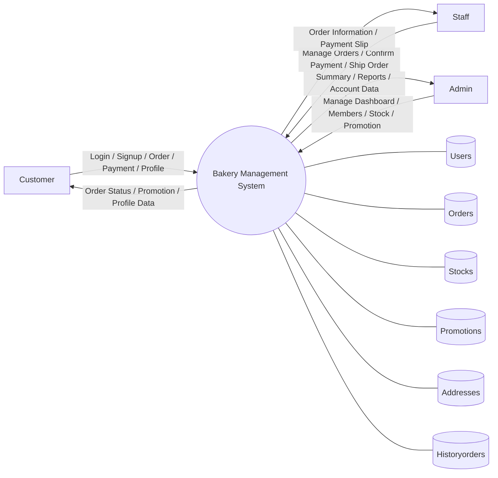
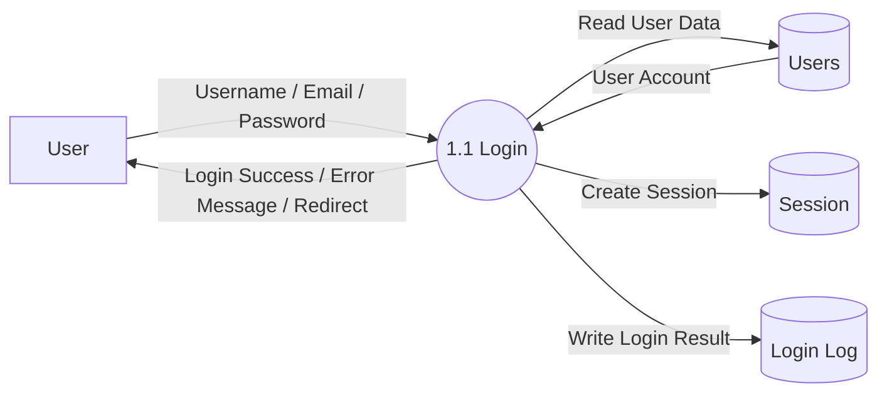
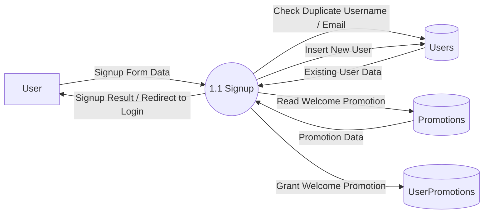
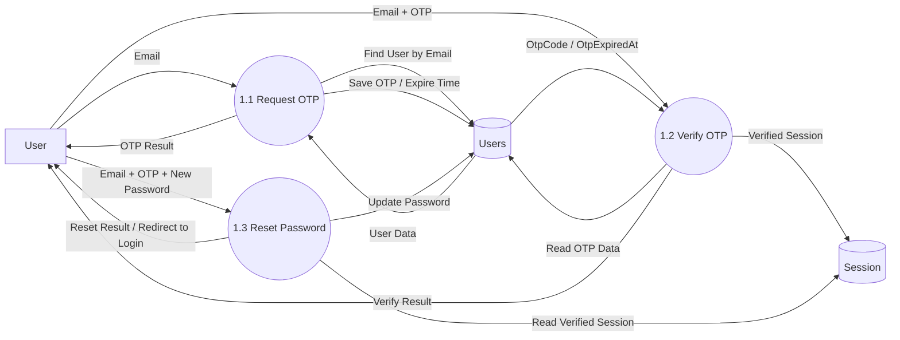
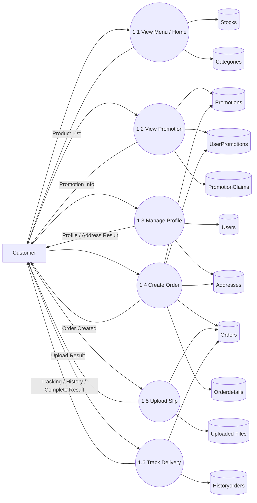
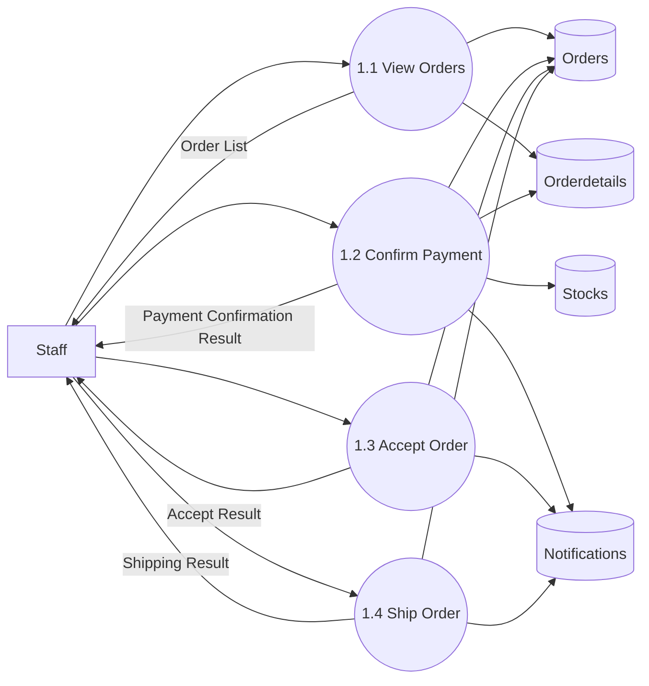
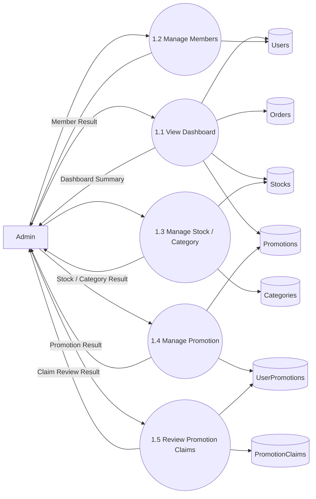
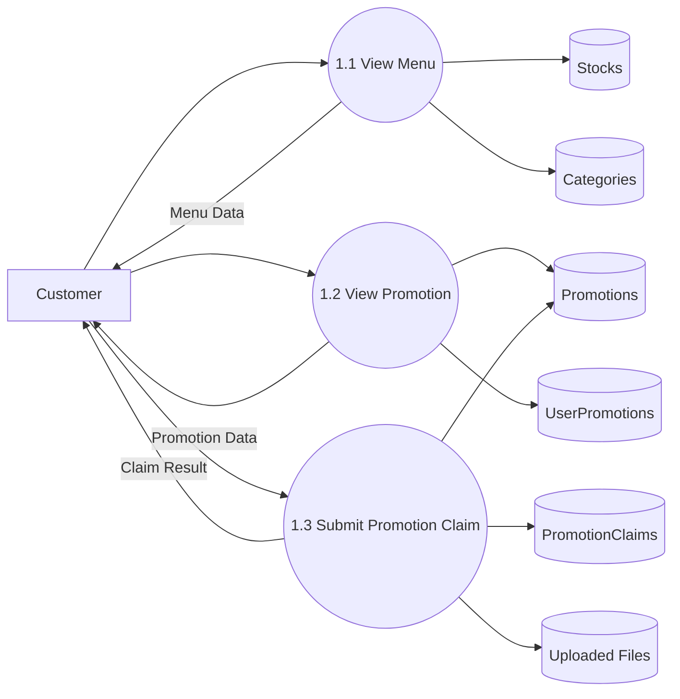
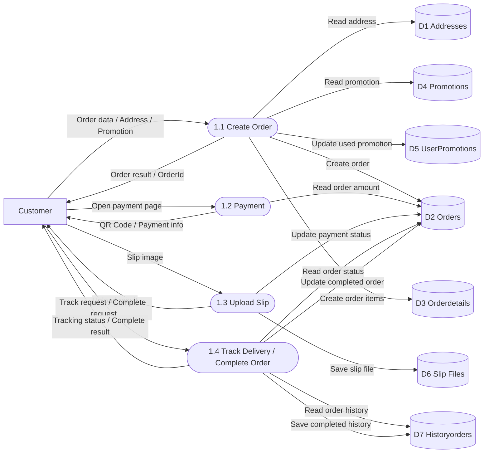

# แผนภาพการไหลของข้อมูล (Data Flow Diagram)

ไฟล์นี้ใช้เป็นแนวทางทำ `Data Flow Diagram (DFD)` ของระบบร้านเบเกอรี่จากโค้ดจริงในโปรเจกต์นี้ โดยจัดให้สามารถนำไปใช้ได้ 2 แบบ

- ใช้ต่อใน `Mermaid`
- ใช้เป็นแบบร่างไปวาดต่อใน `Draw.io`

## ควรทำ DFD หัวข้อไหนบ้าง

หัวข้อที่คุณคิดไว้ถือว่า `ใช้ได้` และเหมาะกับงานนำเสนอภาพรวมของระบบแล้ว

1. `Login`
2. `Register / Signup`
3. `หน้าลูกค้า (Customer / User)`
4. `หน้าพนักงาน (Staff)`
5. `หน้าผู้ดูแลระบบ (Admin)`

## แนะนำให้เพิ่มอีกเล็กน้อย

ถ้าอาจารย์อยากเห็นภาพระบบชัดขึ้นกว่าเดิม แนะนำเพิ่มอีก 2 หัวข้อ

6. `Forgot Password + OTP`
7. `Checkout / Payment / Delivery`

เหตุผลคือ 2 ส่วนนี้เป็น flow หลักของระบบ และมีการรับส่งข้อมูลหลายจุด เช่น

- ผู้ใช้
- ระบบ
- ฐานข้อมูล
- session
- ไฟล์สลิป
- ประวัติคำสั่งซื้อ

ถ้าเวลาน้อยมาก ให้ใช้ 5 หัวข้อแรกได้เลย  
แต่ถ้าต้องการให้ดู “ครบระบบ” มากขึ้น แนะนำใช้ 7 หัวข้อ

---

## หลักการวาด DFD ของระบบนี้

ในการวาด DFD ของโปรเจกต์นี้ ให้คิดเป็น 4 ส่วน

- `External Entity`
  เช่น ลูกค้า, Staff, Admin
- `Process`
  เช่น Login, Signup, Create Order, Confirm Payment
- `Data Store`
  เช่น `Users`, `Orders`, `Addresses`, `Promotions`
- `Data Flow`
  คือข้อมูลที่วิ่งระหว่างกัน เช่น ข้อมูล login, ข้อมูลสมัครสมาชิก, รายการสั่งซื้อ, ข้อมูลสลิป

## Data Store หลักของระบบนี้

จากโครงสร้างระบบจริงของคุณ สามารถใช้อ้างอิงใน DFD ได้ประมาณนี้

- `D1 Users`
- `D2 Roles`
- `D3 Addresses`
- `D4 Promotions`
- `D5 UserPromotions`
- `D6 Orders`
- `D7 Orderdetails`
- `D8 Historyorders`
- `D9 Stocks`
- `D10 Categories`
- `D11 PromotionClaims`
- `D12 Notifications`
- `D13 Uploaded Files`
  เช่น `payment slips`, `promotion claim images`

---

# 1. DFD ภาพรวมระบบ

อันนี้เหมาะใช้เป็น `Context Diagram` หรือ `DFD Level 0`

---

# 2. DFD ระบบ Login

## คำอธิบาย

ลูกค้ากรอก `Username` หรือ `Email` พร้อม `Password` ผ่านหน้า Login  
ระบบจะส่งข้อมูลไปยัง `AccountController` เพื่อตรวจสอบกับตาราง `Users`  
ถ้าข้อมูลถูกต้อง ระบบจะสร้าง session และส่งผู้ใช้ไปยังหน้าที่เหมาะสมตามบทบาท

## ถ้าจะวาดใน Draw.io

ให้วางดังนี้

- ซ้าย: `User`
- กลาง: `1.1 Login`
- ขวา: `Users`, `Session`, `Login Log`
- ลูกศรจาก User ไป Process เป็น `Username / Email / Password`
- ลูกศรกลับจาก Process ไป User เป็น `ผลการเข้าสู่ระบบ`

---

# 3. DFD ระบบ Register / Signup

## คำอธิบาย

ผู้ใช้กรอกข้อมูลสมัครสมาชิก เช่น `Username`, `Email`, `Phone`, `Password`, `ConfirmPassword`  
ระบบจะตรวจสอบข้อมูลซ้ำใน `Users`  
ถ้าผ่านเงื่อนไข ระบบจะบันทึกผู้ใช้ใหม่ และมอบโปรโมชั่นต้อนรับผ่าน `UserPromotions`

---

# 4. DFD ระบบ Forgot Password + OTP

## คำอธิบาย

ผู้ใช้กรอกอีเมลเพื่อขอ OTP  
ระบบตรวจสอบอีเมลจาก `Users` แล้วสร้าง `OtpCode` และ `OtpExpiredAt`  
เมื่อผู้ใช้กรอก OTP และรหัสผ่านใหม่ ระบบจะตรวจสอบความถูกต้องก่อนอัปเดตรหัสผ่าน

---

# 5. DFD หน้าลูกค้า (Customer / User)

## คำอธิบาย

ส่วนของลูกค้าครอบคลุมหลายหน้าหลัก เช่น

- Home
- Menu
- Promotion
- Profile
- Checkout
- Payment
- Delivery

ในภาพรวม ลูกค้าจะดูสินค้า ดูโปรโมชัน แก้ไขโปรไฟล์ สั่งซื้อ และติดตามสถานะคำสั่งซื้อ

---

# 6. DFD หน้าพนักงาน (Staff)

## คำอธิบาย

ในระบบนี้ Staff เกี่ยวข้องกับการจัดการคำสั่งซื้อเป็นหลัก เช่น

- ดูรายการออเดอร์
- ยืนยันการชำระเงิน
- รับออเดอร์
- เปลี่ยนสถานะเป็นจัดส่ง

---

# 7. DFD หน้าผู้ดูแลระบบ (Admin)

## คำอธิบาย

Admin มีสิทธิ์ดูภาพรวมและจัดการข้อมูลหลักของระบบ เช่น

- Dashboard
- สมาชิก
- สินค้าและหมวดหมู่
- โปรโมชัน
- การอนุมัติ promotion claim

---

# 8. DFD ระบบ Menu / Promotion

## คำอธิบาย

หัวข้อนี้แนะนำให้แยกเพิ่ม ถ้าต้องการให้ฝั่งลูกค้าดูชัดขึ้น เพราะเป็นหน้าที่ผู้ใช้เห็นบ่อยมาก

---

# 9. DFD ระบบสั่งซื้อ ชำระเงิน และติดตามสถานะ

## แนวที่แนะนำสำหรับส่งงาน

ถ้าต้องการให้รูปออกมาดูเป็น DFD มาตรฐานแบบงานตัวอย่าง แนะนำให้แยก flow นี้เป็น 4 process หลักตามโค้ดจริงของระบบ

- `1.1 Create Order`
- `1.2 Payment`
- `1.3 Upload Slip`
- `1.4 Track Delivery / Complete Order`

กระบวนการเหล่านี้อ้างอิงจาก action จริงในระบบ ได้แก่ `CreateOrder`, `Payment`, `UploadSlip`, `Delivery` และ `CompleteOrder`

## Mermaid เวอร์ชันมาตรฐาน

## คำอธิบายแบบภาษาคน

- ลูกค้าส่งข้อมูลสินค้า ที่อยู่ และโปรโมชันเข้าสู่ process `1.1 Create Order`
- ระบบอ่านข้อมูลที่อยู่จาก `Addresses` และตรวจสอบโปรโมชันจาก `Promotions` กับ `UserPromotions`
- เมื่อข้อมูลถูกต้อง ระบบจะสร้างรายการใน `Orders` และ `Orderdetails` แล้วส่ง `OrderId` กลับให้ลูกค้า
- จากนั้นลูกค้าจะเข้าสู่ process `1.2 Payment` เพื่อดูยอดชำระและ QR Code ของคำสั่งซื้อ
- เมื่อลูกค้าโอนเงินแล้ว จะเข้าสู่ process `1.3 Upload Slip` เพื่อแนบรูปสลิป โดยระบบจะเก็บไฟล์ไว้ใน `Slip Files` และอัปเดตสถานะการชำระเงินใน `Orders`
- ในขั้นตอนสุดท้าย ลูกค้าสามารถเข้าสู่ process `1.4 Track Delivery / Complete Order` เพื่อดูสถานะการจัดส่งจาก `Orders` และประวัติจาก `Historyorders`
- ถ้าลูกค้าได้รับสินค้าแล้ว ระบบจะอัปเดตคำสั่งซื้อเป็นสถานะเสร็จสมบูรณ์ และบันทึกข้อมูลลง `Historyorders`

## ถ้าจะวาดใน Draw.io ให้ดูเหมือน DFD มาตรฐาน

ให้จัด layout แบบนี้

- ซ้ายสุด: `Customer`
- แถวกลาง: `1.1 Create Order` -> `1.2 Payment` -> `1.3 Upload Slip` -> `1.4 Track Delivery / Complete Order`
- ด้านขวา: `D1 Addresses`, `D2 Orders`, `D3 Orderdetails`, `D4 Promotions`, `D5 UserPromotions`, `D6 Slip Files`, `D7 Historyorders`

### หลักการจัดวาง

1. วาง `Customer` ไว้ทางซ้ายเพียงกล่องเดียว
2. วาง process เป็นกล่องสี่เหลี่ยมมุมมนเรียงแนวนอน 4 กล่อง
3. วาง data store เรียงแนวตั้งทางขวา
4. ให้เส้นข้อมูลวิ่งจากซ้ายไปขวาเป็นหลัก เพื่อลดเส้นไขว้
5. ใช้ชื่อบนลูกศรสั้น ๆ เช่น `Order data`, `Read order`, `Save slip`, `Tracking status`

## ถ้าต้องการเวอร์ชันย่อมาก

ถ้าอาจารย์ต้องการรูปที่ง่ายและไม่แน่นเกินไป สามารถย่อเหลือ 3 process ได้

- `1.1 Create Order`
- `1.2 Upload Slip`
- `1.3 Track Delivery`

และใช้ data store หลักเพียง

- `Orders`
- `Orderdetails`
- `Addresses`
- `Slip Files`
- `Historyorders`

---

# 10. ถ้าจะทำใน Draw.io ควรวาดอย่างไร

ถ้าใช้ Draw.io ให้ใช้รูปทรงตามนี้

- `External Entity`
  ใช้สี่เหลี่ยม
- `Process`
  ใช้วงกลมหรือสี่เหลี่ยมมุมมน
- `Data Store`
  ใช้สัญลักษณ์ฐานข้อมูลหรือสี่เหลี่ยมเปิดด้านข้าง
- `Data Flow`
  ใช้ลูกศรพร้อมข้อความกำกับ

## รูปแบบที่แนะนำ

สำหรับแต่ละหัวข้อ ให้จัด layout แบบซ้ายไปขวา

- ซ้าย: ผู้ใช้งาน เช่น Customer / Staff / Admin
- กลาง: Process หลักของระบบ
- ขวา: Data Store

ตัวอย่างการจัด

- ซ้าย `Customer`
- กลาง `Login Process`
- ขวา `Users`, `Roles`, `Session`

---

# 11. สรุปว่าควรทำหัวข้อไหนบ้าง

ถ้าจะทำแบบพอดีและส่งงานได้ครบ แนะนำชุดนี้

1. Login
2. Register / Signup
3. Forgot Password + OTP
4. Customer
5. Staff
6. Admin

ถ้าต้องการให้ละเอียดขึ้นอีก ให้เพิ่ม

7. Menu / Promotion
8. Checkout / Payment / Delivery

## สรุปสุดท้าย

ถ้าอาจารย์ต้องการ `ภาพรวมระบบ` ให้ใช้ DFD ตามบทบาทผู้ใช้

- Customer
- Staff
- Admin

ถ้าอาจารย์ต้องการ `เห็นกระบวนการหลักของระบบ`

- Login
- Signup
- Forgot Password
- Checkout / Payment / Delivery

ดังนั้นแนวที่ดีที่สุดคือใช้ทั้ง 2 มุมร่วมกัน คือ

- วาดภาพรวมระบบ 1 รูป
- วาดระบบหลักแยกอีก 4-7 รูป

แบบนี้จะดูครบ เข้าใจง่าย และตรงกับระบบจริงของโปรเจกต์คุณมากที่สุด
